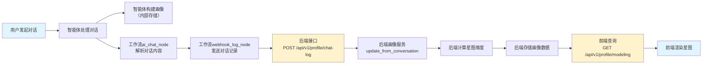

# 用户画像数据流链路分析文档

## 一、背景与目标

### 业务背景
- **智能体系统特性**：智能体在对话过程中会动态构建用户画像
- **业务需求**：需要将画像数据传递到前后端系统，并在前端进行可视化展示
- **展示形式**：前端以"星图"形式展示用户画像的多个维度

### 核心目标
打通从智能体 → 工作流 → 后端 → 前端的完整数据链路，实现画像数据的实时获取与展示。

---

## 二、智能体画像数据来源分析

### 2.1 智能体画像构建机制

根据测试结果和业务描述，智能体的画像构建机制分析如下：

| 维度 | 分析结果 | 说明 |
|------|---------|------|
| **构建时机** | 对话过程中动态更新 | 智能体在每次对话中分析用户行为和问题，更新画像 |
| **构建依据** | 用户对话内容、学习行为、提问方式等 | 从对话中提取好奇心信号、坚持度信号、学习风格等 |
| **数据维度** | 包括但不限于：好奇心指数、坚持度指数、学习风格、知识水平等 | 后端已有部分画像计算能力 |

### 2.2 画像数据可能返回位置（关键分析点）

**问题**：智能体画像数据如何传递到外部系统？

根据智能体API响应分析，画像数据可能存在于以下位置：

| 可能位置 | 分析 | 证据 |
|---------|------|------|
| **事件流中的特定事件类型** | ❌ 未发现 | 测试了5种事件类型（message_start/tool_request/tool_response/answer/verbose），均未发现画像数据 |
| **响应体metadata字段** | ❌ 未发现 | 当前响应体只包含基本字段，无画像数据 |
| **专门的画像查询接口** | ⚠️ 可能存在 | 智能体团队可能提供独立的画像查询API（需要确认） |
| **智能体内部存储** | ⚠️ 可能存在 | 画像数据存储在智能体内部数据库，需要专门接口提取 |

**关键结论**：
- ❌ 当前智能体对话API（stream_run）**未直接返回画像数据**
- ⚠️ 画像数据可能需要通过**专门的接口**获取（需与智能体团队确认）

---

## 三、数据传递方案对比分析

### 3.1 方案对比表

根据你的需求分析，存在三种主要的数据传递方案：

| 方案 | 机制说明 | 可行性 | 优点 | 缺点 | 适用场景 |
|------|---------|--------|------|------|---------|
| **方案A：Webhook回调** | 工作流通过webhook_log_node向`POST /api/v1/profile/chat-log`发送数据 | ⭐⭐⭐⭐⭐ 最高 | 1. 不依赖智能体接口修改<br>2. 利用现有工作流节点<br>3. 数据传递可控 | 1. 需后端实现接口<br>2. 需后端实现画像计算逻辑 | **推荐方案**（智能体不直接返回画像时） |
| **方案B：响应体携带** | 在`/run`接口返回的JSON中新增`profile`字段或专门的事件类型 | ⭐⭐⭐☆☆ 中等 | 1. 数据随响应返回，实时性好<br>2. 前端可立即获取 | 1. **依赖智能体返回画像数据**<br>2. 需修改ai_chat_node解析逻辑 | 适用场景：智能体已在对话中返回画像数据 |
| **方案C：独立查询接口** | 由智能体团队提供专门的画像查询API，后端主动调用 | ⭐⭐☆☆☆ 较低 | 1. 画像数据完整<br>2. 可按需查询 | 1. **依赖智能体团队提供接口**<br>2. 需后端实现定时任务或按需调用逻辑<br>3. 实时性差 | 适用场景：智能体有专门的画像存储系统 |

### 3.2 方案详细分析

#### **方案A：Webhook回调（推荐）**

**核心逻辑**：
```
智能体对话 → 工作流（ai_chat_node → webhook_log_node）
          → POST /api/v1/profile/chat-log（发送对话记录）
          → 后端 UserProfileService.update_from_conversation()
          → 后端计算画像并映射到星图维度
          → 存储画像数据
          → GET /api/v1/profile/modeling（前端查询）
          → 前端星图展示
```

**关键步骤分析**：

1. **工作流层面**：
   - `ai_chat_node`：调用智能体，解析对话内容（已有）
   - `webhook_log_node`：向后端发送对话记录（已有）
   - **需要增强**：在发送的对话记录中包含完整的对话内容（用户问题+智能体回复）

2. **后端层面**：
   - 接收Webhook请求：`POST /api/v1/profile/chat-log`（需确认是否已实现）
   - 调用画像计算方法：`UserProfileService.update_from_conversation()`（已有）
   - **需要实现**：画像数据映射到6个星图维度的逻辑
   - **需要实现**：`GET /api/v1/profile/modeling`接口（前端查询）

**优势分析**：
- ✅ 不依赖智能体接口修改（智能体可以不直接返回画像）
- ✅ 利用现有工作流节点（webhook_log_node）
- ✅ 数据传递可控（后端自主计算画像）
- ✅ 实时性好（每次对话后立即更新画像）

**挑战分析**：
- ⚠️ 需后端实现完整的画像计算逻辑
- ⚠️ 需后端实现星图维度映射逻辑
- ⚠️ 画像计算准确性依赖对话内容分析算法

---

#### **方案B：响应体携带（依赖智能体返回画像）**

**核心逻辑**：
```
智能体对话 → 智能体返回画像数据（在特定事件或响应体中）
          → 工作流ai_chat_node解析画像数据
          → 返回给前端（/run接口）
          → 前端直接渲染星图
```

**关键步骤分析**：

1. **智能体层面**：
   - 需确认：智能体是否在对话中返回画像数据？
   - 需确认：画像数据在哪个事件类型中？（verbose？专门事件？）
   - 需确认：画像数据的格式是什么？

2. **工作流层面**：
   - `ai_chat_node`：需修改事件解析逻辑，提取画像数据
   - 需新增：画像数据保存到状态

3. **前端层面**：
   - 直接从响应中获取画像数据，渲染星图

**优势分析**：
- ✅ 数据实时传递，前端立即获取
- ✅ 画像数据由智能体计算（准确性高）
- ✅ 无需后端额外处理

**挑战分析**：
- ❌ **核心依赖**：智能体必须在对话中返回画像数据（当前未发现）
- ⚠️ 需与智能体团队沟通，确认画像数据返回机制
- ⚠️ 需修改工作流节点逻辑

---

#### **方案C：独立查询接口（依赖智能体团队）**

**核心逻辑**：
```
前端/后端 → 调用智能体画像查询API
          → 获取画像数据
          → 后端处理/前端直接渲染
```

**关键步骤分析**：

1. **智能体层面**：
   - 需确认：智能体团队是否提供专门的画像查询API？
   - 需确认：API格式和返回数据结构？

2. **后端层面**：
   - 需实现：定时任务或按需调用逻辑
   - 需实现：画像数据缓存和处理

3. **前端层面**：
   - 通过后端代理查询或直接调用智能体API

**优势分析**：
- ✅ 画像数据完整（智能体维护的完整画像）
- ✅ 可按需查询

**挑战分析**：
- ❌ **核心依赖**：智能体团队需提供专门API（依赖外部）
- ⚠️ 实时性差（需定时任务或按需调用）
- ⚠️ 增加系统复杂度（额外接口调用）

---

### 3.3 方案推荐

**综合分析结论**：

| 优先级 | 方案 | 推荐理由 |
|--------|------|---------|
| **🥇 第一优先** | 方案A：Webhook回调 | 不依赖智能体接口修改，利用现有工作流节点，后端自主计算画像，实时性好 |
| **🥈 第二优先** | 方案B：响应体携带 | 如果智能体已返回画像数据，这是最简单直接的方案 |
| **🥉 第三优先** | 方案C：独立查询接口 | 依赖智能体团队提供接口，实时性差，作为补充方案 |

---

## 四、后端画像数据处理逻辑分析

### 4.1 后端画像计算能力现状

根据你的图片描述，后端已有的画像计算能力：

| 画像维度 | 计算依据 | 状态 |
|---------|---------|------|
| `curiosity_index`（好奇心指数） | 用户提问、探索、深度学习信号 | ✅ 已有 |
| `persistence_index`（坚持度指数） | 连续学习天数、复习完成率 | ✅ 已有 |
| `preferred_learning_style`（学习风格） | 对话内容分析 | ✅ 已有 |
| `knowledge_level`（知识水平） | 对话内容分析 | ✅ 已有 |

**核心方法**：
- `UserProfileService.update_from_conversation()`：从对话内容中提取画像信号

### 4.2 画像映射到星图维度分析

**业务需求**：将画像数据映射到6个星图维度

**映射逻辑分析**：

假设前端需要的6个星图维度为（需确认具体维度）：
1. 学习能力维度
2. 探索精神维度（对应好奇心指数）
3. 持续性维度（对应坚持度指数）
4. 学习风格维度
5. 知识掌握维度
6. 学习进度维度

**映射关系示例**：

| 星图维度 | 后端画像数据 | 映射逻辑 |
|---------|------------|---------|
| **探索精神** | `curiosity_index` | 直接映射，范围0-100 |
| **持续性** | `persistence_index` | 直接映射，范围0-100 |
| **学习风格** | `preferred_learning_style` | 映射为分类标签（visual/auditory/kinesthetic） |
| **知识掌握** | `knowledge_level` | 映射为等级（beginner/intermediate/advanced） |
| **学习能力** | 综合计算 | 基于`curiosity_index`和`persistence_index`的综合评分 |
| **学习进度** | 课程完成率 | 从学习记录中计算 |

### 4.3 后端接口实现分析

**需要的后端接口**：

| 接口 | 功能 | 输入 | 输出 | 实现状态 |
|------|------|------|------|---------|
| `POST /api/v1/profile/chat-log` | 接收对话记录，触发画像更新 | 对话记录JSON | 更新结果 | ❓ 需确认 |
| `GET /api/v1/profile/modeling` | 查询用户画像数据 | user_id | 星图画像JSON | ❌ 需实现 |

**接口实现逻辑分析**：

#### **POST /api/v1/profile/chat-log 接口逻辑**：

```python
# 伪代码分析
def handle_chat_log(request):
    # 1. 接收对话记录
    user_id = request.get("user_id")
    user_message = request.get("user_message")
    assistant_response = request.get("assistant_response")
    
    # 2. 调用画像更新方法
    UserProfileService.update_from_conversation(
        user_id=user_id,
        conversation=user_message + assistant_response
    )
    
    # 3. 计算并映射到星图维度
    profile = UserProfileService.calculate_star_map(user_id)
    
    # 4. 存储画像数据
    UserProfileService.save_profile(user_id, profile)
    
    # 5. 返回结果
    return {"success": True, "profile_updated": True}
```

#### **GET /api/v1/profile/modeling 接口逻辑**：

```python
# 伪代码分析
def get_profile_modeling(user_id):
    # 1. 查询用户画像数据
    profile = UserProfileService.get_profile(user_id)
    
    # 2. 格式化为星图数据
    star_map = {
        "user_id": user_id,
        "dimensions": [
            {"name": "探索精神", "score": profile.curiosity_index, "max": 100},
            {"name": "持续性", "score": profile.persistence_index, "max": 100},
            {"name": "学习风格", "type": profile.learning_style},
            {"name": "知识掌握", "level": profile.knowledge_level},
            {"name": "学习能力", "score": calculate_ability_score(profile)},
            {"name": "学习进度", "score": profile.progress_rate}
        ],
        "timestamp": profile.last_updated
    }
    
    # 3. 返回星图数据
    return star_map
```

---

## 五、前端星图渲染方案分析

### 5.1 前端渲染逻辑分析

**前端渲染流程**：

```
前端发起请求 → GET /api/v1/profile/modeling
            → 接收星图画像数据
            → 解析数据结构
            → 渲染星图组件
```

**关键渲染步骤**：

1. **数据获取**：
   - 使用 `profileModelingStore.fetchProfileModel()` 发起GET请求
   - 接收响应数据并解析

2. **数据处理**：
   - 将后端返回的画像数据转换为前端星图组件所需格式
   - 计算各维度的可视化参数（如雷达图的坐标）

3. **星图渲染**：
   - 使用图表库（如ECharts、D3.js）渲染雷达图/星图
   - 标注各维度的数值和标签
   - 动态更新效果

### 5.2 前端数据格式分析

**前端期望的数据格式**（需确认）：

```json
{
  "user_id": "user_001",
  "dimensions": [
    {
      "name": "探索精神",
      "score": 85,
      "max": 100,
      "description": "用户具有较强的好奇心和探索欲望"
    },
    {
      "name": "持续性",
      "score": 70,
      "max": 100,
      "description": "用户学习持续性中等，建议加强复习频率"
    },
    {
      "name": "学习风格",
      "type": "visual",
      "description": "用户偏好视觉学习方式，建议使用图表和视频"
    },
    {
      "name": "知识掌握",
      "level": "intermediate",
      "score": 60,
      "description": "用户知识水平为中级，建议学习进阶内容"
    },
    {
      "name": "学习能力",
      "score": 75,
      "max": 100,
      "description": "综合学习能力评分"
    },
    {
      "name": "学习进度",
      "score": 40,
      "max": 100,
      "description": "当前课程完成进度"
    }
  ],
  "timestamp": "2026-06-04T20:00:00Z",
  "recommendations": [
    "建议加强复习频率，提升持续性评分",
    "推荐使用可视化学习资源，匹配学习风格"
  ]
}
```

### 5.3 前端渲染组件分析

**渲染方式对比**：

| 渲染方式 | 适用场景 | 优点 | 缺点 |
|---------|---------|------|------|
| **雷达图** | 展示多维度评分 | 直观展示各维度对比 | 不适合分类维度（如学习风格） |
| **星图** | 展示多维度评分和分类 | 可同时展示评分和分类标签 | 实现复杂度较高 |
| **多维数据卡片** | 展示评分和建议 | 清晰展示各维度详情 | 不够直观对比 |

---

## 六、完整数据流链路分析

### 6.1 数据流链路图（方案A：Webhook回调）



### 6.2 数据流关键节点分析

| 节点 | 功能 | 输入 | 输出 | 关键逻辑 |
|------|------|------|------|---------|
| **智能体对话** | 处理用户对话，构建画像 | 用户问题 | 智能体回复 + 画像更新 | 智能体内部画像构建机制 |
| **工作流ai_chat_node** | 调用智能体API | 用户查询 | 智能体回复 + events | 解析智能体响应 |
| **工作流webhook_log_node** | 发送对话记录 | 对话记录 | Webhook请求结果 | 向后端发送完整对话 |
| **后端chat-log接口** | 接收对话，触发画像更新 | 对话JSON | 更新结果 | 调用画像计算方法 |
| **后端画像服务** | 计算画像和星图维度 | 对话内容 | 画像数据 | 从对话中提取信号 |
| **后端modeling接口** | 提供画像查询 | user_id | 星图JSON | 返回格式化的画像数据 |
| **前端星图组件** | 渲染星图 | 星图JSON | 可视化展示 | 数据解析和图表渲染 |

---

## 七、关键问题与待确认事项

### 7.1 待确认的关键问题

| 问题 | 影响方案 | 需确认方 | 优先级 |
|------|---------|---------|--------|
| **智能体是否在对话中返回画像数据？** | 决定方案B可行性 | 智能体团队 | 🔴 最高 |
| **智能体是否有专门的画像查询API？** | 决定方案C可行性 | 智能体团队 | 🟠 高 |
| **后端POST /api/v1/profile/chat-log接口是否已实现？** | 决定方案A实施路径 | 后端团队 | 🔴 最高 |
| **后端是否已完成星图维度映射逻辑？** | 决定后端工作量 | 后端团队 | 🟠 高 |
| **前端期望的星图数据格式是什么？** | 决定后端接口设计 | 前端团队 | 🟡 中 |

### 7.2 数据格式待确认

**需要确认的数据格式**：

1. **智能体画像数据格式**（如果存在）
   - 包含哪些字段？
   - 数据类型和范围？

2. **前端星图数据格式**
   - 6个维度具体是什么？
   - 每个维度的数据类型？
   - 是否需要建议信息？

---

## 八、实施建议总结

### 8.1 最优实施路径（推荐）

**基于方案A（Webhook回调）的完整实施路径**：

| 步骤 | 负责方 | 工作内容 | 依赖关系 |
|------|--------|---------|---------|
| **Step 1** | 工作流团队 | 确认webhook_log_node发送完整的对话记录 | 无依赖 |
| **Step 2** | 后端团队 | 实现POST /api/v1/profile/chat-log接口 | 依赖Step 1 |
| **Step 3** | 后端团队 | 实现画像映射到星图维度逻辑 | 依赖Step 2 |
| **Step 4** | 后端团队 | 实现GET /api/v1/profile/modeling接口 | 依赖Step 3 |
| **Step 5** | 前端团队 | 实现星图渲染组件 | 依赖Step 4 |
| **Step 6** | 全团队 | 测试完整数据流链路 | 依赖所有步骤 |

### 8.2 风险与挑战

| 风险/挑战 | 影响 | 解决方案 |
|---------|------|---------|
| **智能体不返回画像数据** | 方案B不可行 | 采用方案A，后端自主计算 |
| **后端接口未实现** | 方案A无法实施 | 协调后端团队优先实现接口 |
| **画像计算准确性不足** | 前端展示数据不准 | 优化画像计算算法，引入更多信号源 |
| **前端渲染性能问题** | 用户体验差 | 优化渲染逻辑，使用缓存策略 |

---

## 九、总结与下一步行动

### 9.1 分析总结

**核心结论**：
1. ✅ 工作流层面已具备基础能力（ai_chat_node + webhook_log_node）
2. ⚠️ 智能体画像数据传递机制需确认（未直接返回画像数据）
3. ⚠️ 后端画像计算和星图映射逻辑需实现
4. ❌ 前端GET /api/v1/profile/modeling接口不存在

**最优方案**：方案A（Webhook回调）
- 不依赖智能体接口修改
- 利用现有工作流节点
- 后端自主计算画像
- 实时性好，可控性强

### 9.2 下一步行动建议

**立即行动**：
1. ✅ 确认智能体画像数据传递机制（与智能体团队沟通）
2. ✅ 确认后端接口实现状态（与后端团队沟通）
3. ✅ 确认前端星图数据格式（与前端团队沟通）

**后续实施**：
1. 完善工作流webhook_log_node（确保发送完整对话记录）
2. 协调后端实现接口和画像计算逻辑
3. 前端实现星图渲染组件
4. 测试完整数据流链路

---

**文档版本**：v1.0
**创建时间**：2026-06-04
**适用场景**：用户画像数据流链路分析